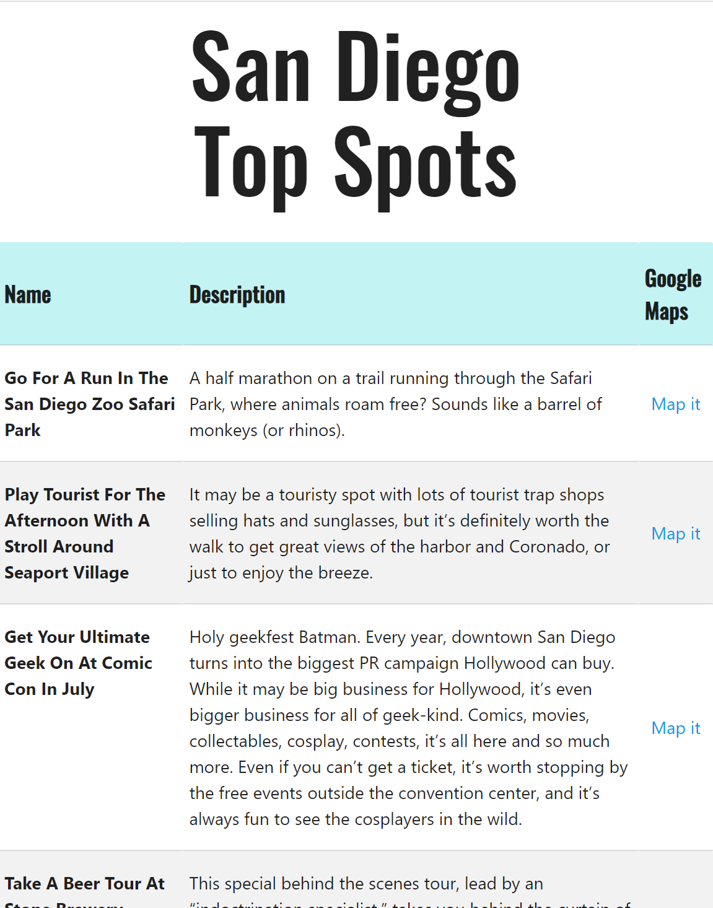
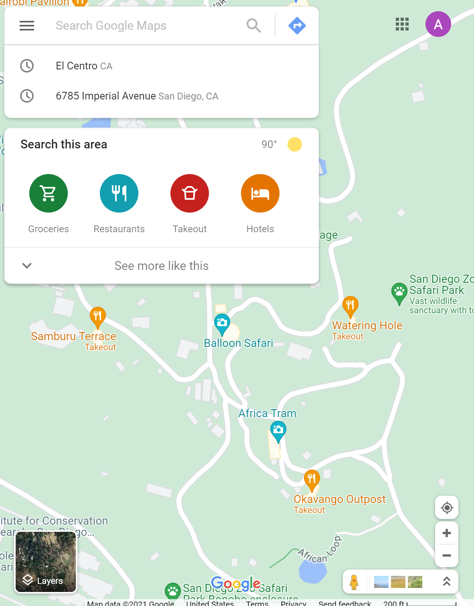

  
   

# San Diego Top spots App

The San Diego Top Spots App displays popular destinations in San Diego. A name
,description and link for each destination is displayed.

## How It Works

1. The user clicks on the `Find It` link for a location of interest and then taken
to a Google Map centered over the pinned location.

## How It was built

This app demonstrates how an app can interact with multiple API's to obtain and display
data. In this project a JSON file exists locally storing informaion for each location
including the name, description and longitude / latitude coordinates for the respective
"spot".

Jquery's getJSON method is used to obtain JSON encoded data and then return an object 
whereby the data inside can be accessed as key / value pairs. We can than iterate over
this data and display it in an organized fashion, in this case a data table. The stored
JSON file could have easily repleaced to an API call to some external source. 

Included in the data obtained in the JSON file are coordinates for each location. This data
is fed into Googles API to display the data point on a map. 

## Credits

[Materialize] was the CSS framework used for this application and [Google Fonts] provided
the Orbitron font used in the header of this app. [Google Maps] was used to display each 
location on a map.

[Google Fonts]: https://fonts.google.com/ 
[Materialize]: https://materializecss.com/
[Google Maps]: https://www.google.com/maps

## Live App

This App is now live and can be visited at: https://alexkmartinez77.github.io/web102-san-diego-top-spots/

